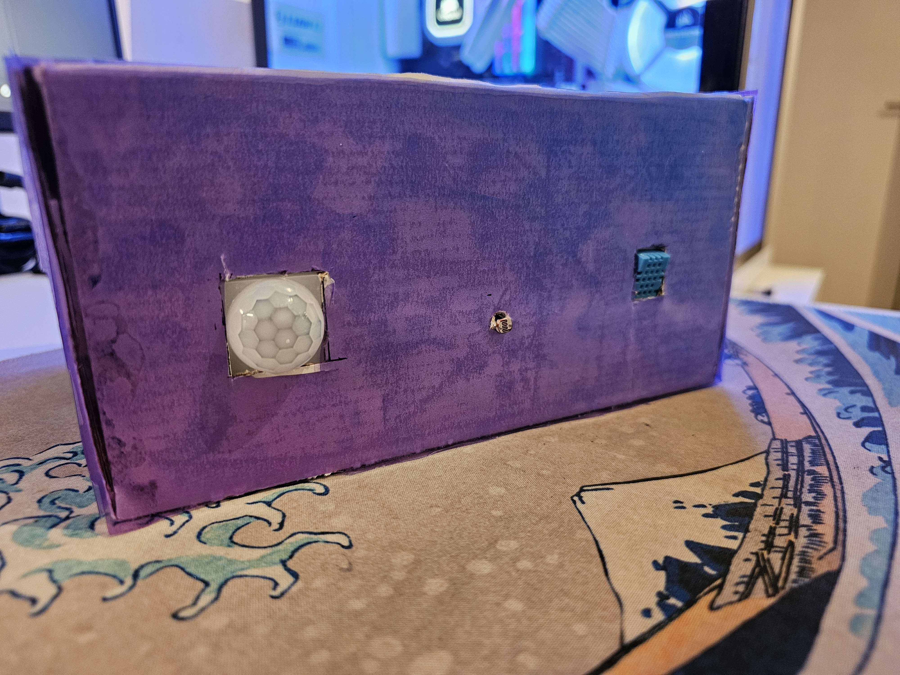
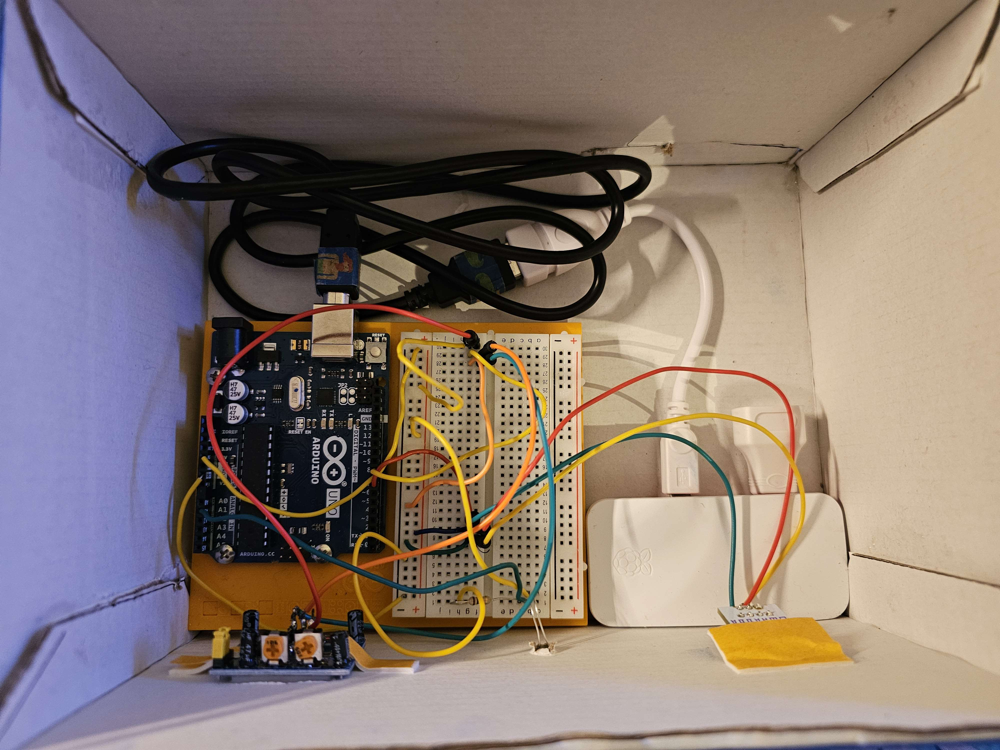
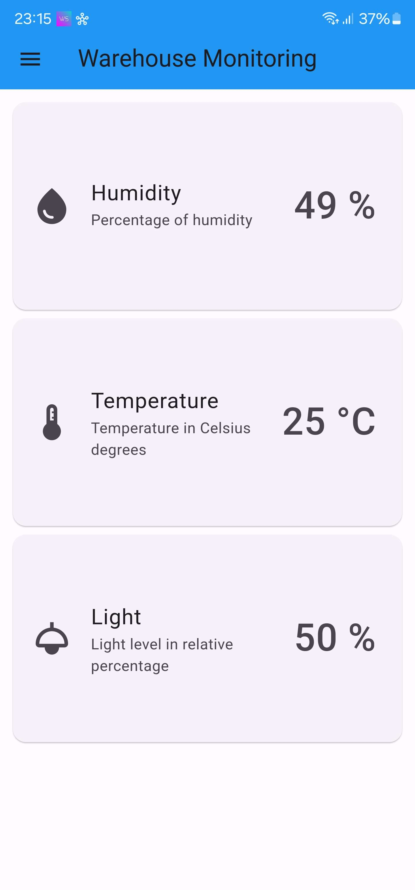
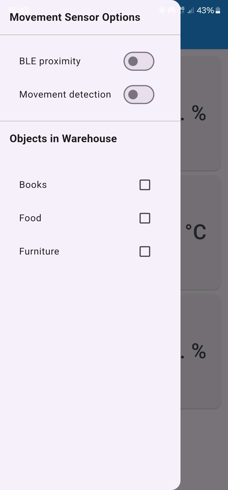

# WareSmart - A smart warehouse hazard detection

### Work done by:
- [Francisco Sousa](https://github.com/franciscomcsousa)
- [Miguel Porfírio](https://github.com/miguelporfirio19)
- [Sara Aguincha](https://github.com/SaraAguincha)

This work was done for the [Ambient Intelligence](https://fenix.tecnico.ulisboa.pt/disciplinas/AI3/2023-2024/2-semestre) course at [Instituto Superior Técnico](https://tecnico.ulisboa.pt/en/).

## Table of contents
- [General Information](#general-information)
    - [What is Waresmart?](#what-is-waresmart)
    - [Smart Features](#smart-features)
- [Technical Information](#technical-information)
    - [Used technologies](#used-technologies)
    - [BluetoothBLE](#bluetooth-ble)
    - [Backend](#backend)
        - [Python Virtual Environment](#python-virtual-environment)
        - [Reverse Proxy](#reverse-proxy)
    - [Frontend](#frontend)
- [Photo Gallery](#photo-gallery)
    - [Top View](#top-view)
    - [Front View](#front-view)
    - [Inside View](#inside-view)
    - [App Home Screen](#app-home-screen)
    - [App Drawer](#app-drawer)


## General Information

### What is WareSmart?

WareSmart focus on protecting your warehouse against both environmental and third-party hazards. This system alerts you anytime there has been any substancial temperature or humidity change in your warehouse, as well as unauthorized movement in place.

### Smart Features

WareSmart lets you choose between various presets of what is stored in your warehouse, these being books, animals, food, wine, or many others. Depending on the temperature and humidity levels, WareSmart will notify your smartphone if any of these get out of the safe range for all of your selected presets.

WareSmart also has an integrated BLE (Bluetooth Low Energy) that won't trigger your Movement detection if your phone is close enough to your warehouse (withing a 2 meter range). This feature can be turned of at will by the user.

## Technical Information

### Used technologies

- [Flask](https://flask.palletsprojects.com/en/3.0.x/)
- [Flutter](https://flutter.dev/)
- [Nginx](https://www.nginx.com/)
- [Raspberry Pi](https://www.raspberrypi.org/)
- [Arduino](https://www.arduino.cc/)

### Bluetooth BLE
WareSmart uses Bluetooth BLE to check for user proximity by checking the user's [RSSI](https://en.wikipedia.org/wiki/Received_signal_strength_indicator). We've implemented a script where the Raspberry Pi continiously search for nearby MAC Adresses' that correspond to the given one.

```cd bluetooth```
```bash scan.sh```

### Backend

All the backend operations are run in the Raspberry Pi. This includes both the web server and the bluetooth proximity script.

#### Python virtual environment

- To create virtual environment:

    ```$ python3.11 -m venv .venv```

- To activate virtual environment

    ```$ source .venv/bin/activate```

- To install pip packages:

    ```$ pip install -r requirements.txt```

- To exit virtual environment:

    ```$ deactivate```

#### Reverse proxy

- Nginx file:
```
$ cat /etc/nginx/sites-available/smart_storage 
server {
  listen 80;
  listen [::]:80;
  
  # server_name IP_ADDRESS; # Change this field to the machine IP address
  
  location / {
    proxy_pass http://127.0.0.1:8000/;
  }
}
```

- **Note** - Create a link of the previous file to `sites-enabled` (remove the default one aswell):

    ```$ ln -s ../sites-available/smart_storage smart_storage```

### Frontend

- To enter the environment:

    ```$ cd frontend/application```

- To run the aplication:
    ```$ flutter run```

## Photo Gallery

### Top View


### Front View



### Inside View


### App Home Screen


### App Drawer

